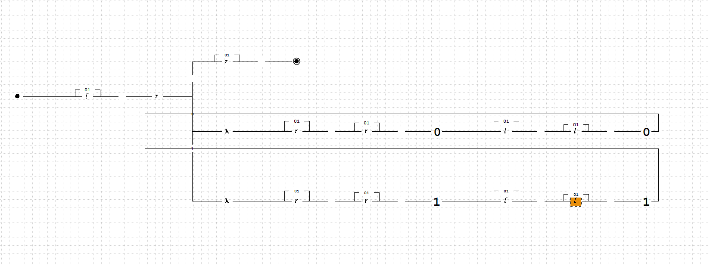
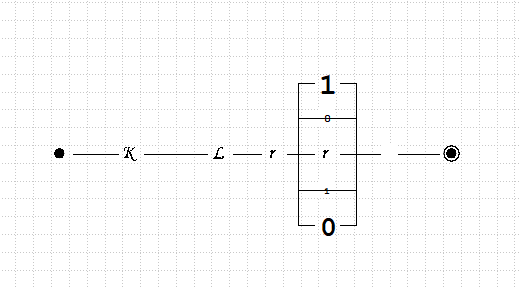

# Отчет по лабораторной работе № 6
## по курсу "Прикладная математика и информатика"

Студент группы М8О-108Б-23 Денисов Константин Дмитриевич

Работа выполнена 

Преподаватель: каф. 806 Севастьянов Виктор Сергеевич

1. **Тема**: Конструирование диограммы Тьюринга
2. **Цель работы**: научиться работать с диаграммой Тьюринга
3. **Задание**: 
- Получение обратной кодировки двоичного отризательного числа с тем же абсолютным значением
4. **Идея, метод, алгоритм решения задачи**: 
- 
5. **Сценарий выполнения работы**: 
- Копирование числа

- получение обратной кодирови

```
7. **Выводы**: Изначально я не понимал как работает диограмма машины Тьюринга и вообще не представлял как написать на ней программу. Но после изучения материала я научился работать с диограммамой машины Тьюринга и выполнять с её помощью разные задания. 
